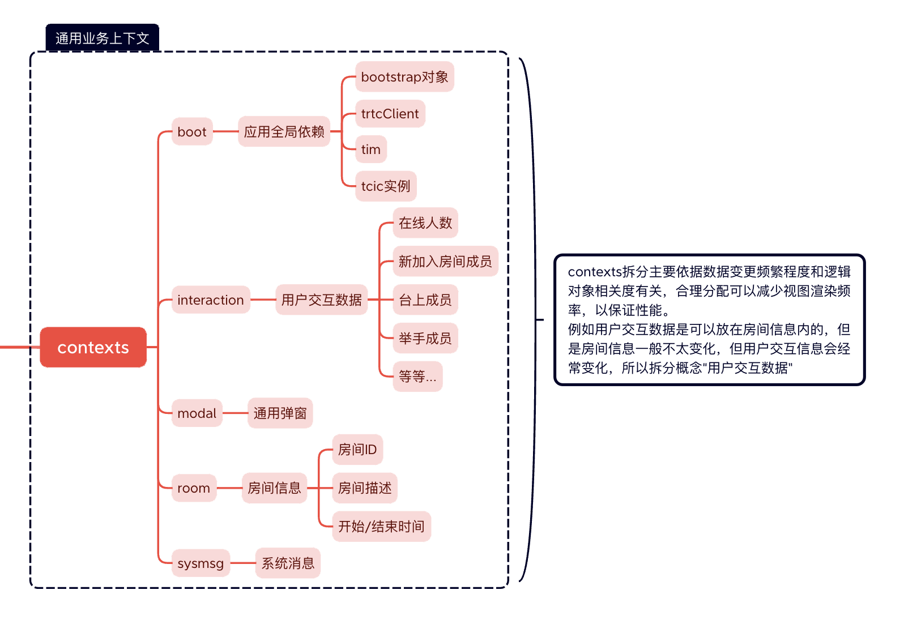

# UI-less SDK demo


This demo starts from [Real time Interaction - Education Edition]（ https://www.tencentcloud.com/document/product/1168/53651 ) Integrated mobile e-commerce version of the business function SDK.
Supports functions such as microphone connection, barrage, and number management. Temporary experience [link](https://dev-class.qcloudclass.com/next/)。


# Framework and environmental dependencies
- nextjs 14+ ，Supporting flexible business development modes and performance optimization solutions, static deployment, SSR rendering, reference [documents](https://nextjs.org/docs)
- nodejs 20，If there are multiple nodejs environments locally, it is recommended to use 'nvm' for management, reference [documents](https://github.com/nvm-sh/nvm) 
- bootstrap，Basic style and responsive feature support, reference [documents](https://getbootstrap.com/docs/5.3/getting-started/introduction/)

# Development Guide

```bash
npm i 
npm run dev
```
By default, port 8100 is started and can be modified in the 'package. json' file.


The ` .env ` environment variable file currently mainly includes the following variables:

- NEXT_PUBLIC_BASE_PATH：The base path for project access, which defaults to `/next`, `http://localhost:8100/next` 
  
# Project Architecture

Before becoming familiar with the project architecture, it is necessary to understand the predefined routing structure of the nextjs framework（ https://nextjs.org/docs/app/building-your-application/routing/pages-and-layouts ）And [document]（ https://nextjs.org/docs/app/api-reference/file-conventions ）.

After reading the above content, refer to this figure to understand the business functions of the code base. The basic business functions are due to context:




# FAQ

- It should be noted that by default, it is written in the `app` directory as a server-side component. The code supports node-side rendering. For the pure browser-side basic library introduction method, refer to `bootstrap.min.js` through external links and `npm` package introduction method. See `watch_sdk`.


# 中文版


# 无UI版SDK demo
本demo从[实时互动-教育版](https://cloud.tencent.com/product/lcic)的业务功能SDK集成移动电商版本。
支持连麦，弹幕，人数管理等功能。临时体验[地址](https://dev-class.qcloudclass.com/next/)。


# 框架和环境依赖
- nextjs 14版本 ，支持较灵活的业务开展模式和性能优化方案，静态化部署，SSR渲染，相关[文档](https://nextjs.org/docs)
- nodejs20，如果本地有多nodejs 环境，建议用`nvm`进行管理，相关[文档](https://github.com/nvm-sh/nvm) 
- bootstrap，基础样式和响应式功能支持，相关[文档](https://getbootstrap.com/docs/5.3/getting-started/introduction/)

# 开发指南
> 同时开发watch_sdk，需要链接基础库 `npm link /your/path/watch_sdk`,不开发忽略此条

```bash
npm i 
npm run dev
```
默认启动 8100 端口，可以在`package.json`文件内修改。

`.env`环境变量文件，目前主要包含以下变量：

- NEXT_PUBLIC_BASE_PATH：项目访问的基础路径，默认为 `/next`,启动环境后从`http://localhost:8100/next` 路径访问首页
  
# 项目架构简介

熟悉项目架构前，需要了解nextjs框架预定义[路由结构](https://nextjs.org/docs/app/building-your-application/routing/pages-and-layouts)和[文件](https://nextjs.org/docs/app/api-reference/file-conventions)。
阅读完上述内容后，参考此图以了解代码基座业务功能，基础业务功能由于contexts:


# FAQ

- 需要注意的是默认写在`app`目录下为服务端组件，代码支持node端渲染，纯浏览器端基础库引入方式参考`bootstrap.min.js`通过外链引入，`npm`包引入方式参考`watch_sdk`。

